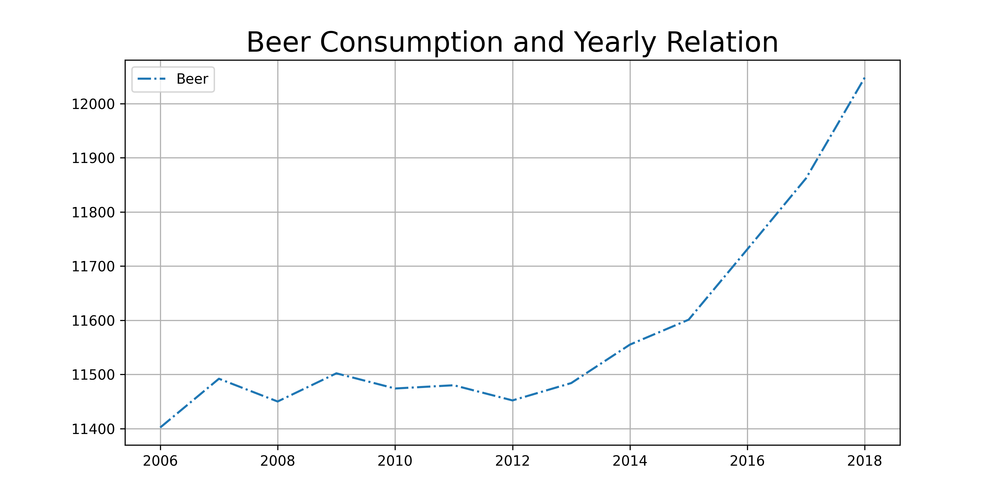

4. The title of the following papers pivotal to our knowledge:
* MCC Van Dyke et al., 2019
* JT Harvey, Applied Ergonomics, 2002
* DW Ziegler et al., 2005

5. Create one plot from the dataset "istherecorrelation.csv".

Between 2006 and 2012, beer consumption remained relatively steady, but from 2012 to 2018, there was a significant surge in beer consumption, starting at 11,452 hectoliters in 2012 and reaching 12,048 hectoliters in 2018.

The data suggests that beer consumption in the Netherlands has been gradually growing over this period, possibly indicating a sustained interest in beer in the country.
