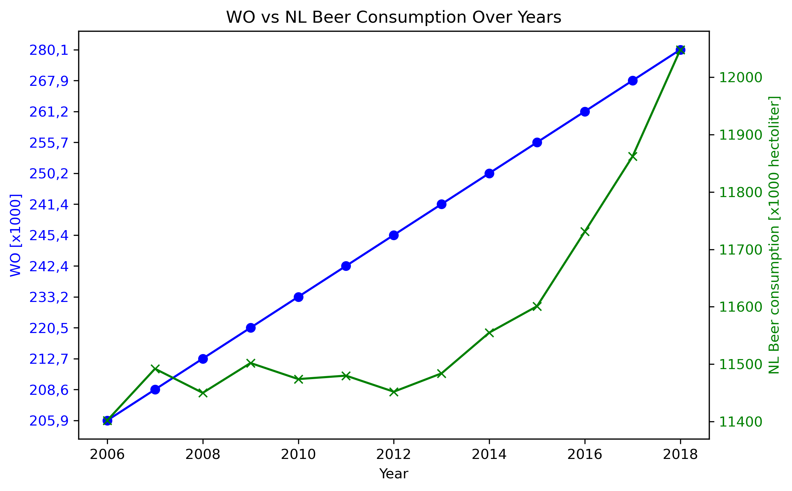

## Computational Scientist's Toolbox Assignment

# Titles
"Fantastic yeasts and where to find them: the hidden diversity of dimorphic fungal pathogens", MCC Van Dyke et al., 2019
"An analysis of the forces required to drag sheep over various surfaces", JT Harvey, Applied Ergonomics, 2002
"The neurocognitive effects of alcohol on adolescents and college students", DW Ziegler et al., 2005

# Is there correleation plot

The dark blue line corresponds to 'WO [x1000]' and the green light corresponds to 'NL beer consumption [x1000 hectoliter]'. The WO has a linear increase, while the NL beer consumption experiences a exponential growth from the year 2012. We can conclude that seems to be a correlation between WO and NL beer consumption as they both grow over the whole time period. 

Made by: Haron Malash, student id: 15179192, Computational Science Academic Skills