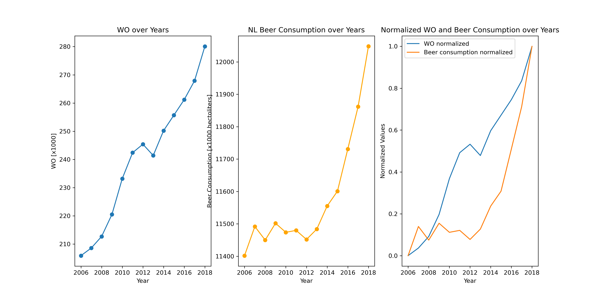

## Student ID
16390288  

## Papers
- MCC Van Dyke et al., 2019: *The Rise of Coccidioides: Forces Against the Dust Devil Unleashed*  
- JT Harvey, Applied Ergonomics, 2002: *An Analysis of the Forces Required to Drag Sheep over Various Surfaces*  
- DW Ziegler et al., 2005: *The Neurocognitive Effects of Alcohol on Adolescents and College Students*  

## Visualization
Here is the plot I created from the dataset **istherecorrelation.csv**:  

  

## Interpretation
The graph shows that both WO and beer consumption in the Netherlands have increased over the years.  
The normalized comparison suggests a potential positive correlation between the two trends.  
While correlation does not imply causation, the data highlights how the two variables evolve in a similar way.  
