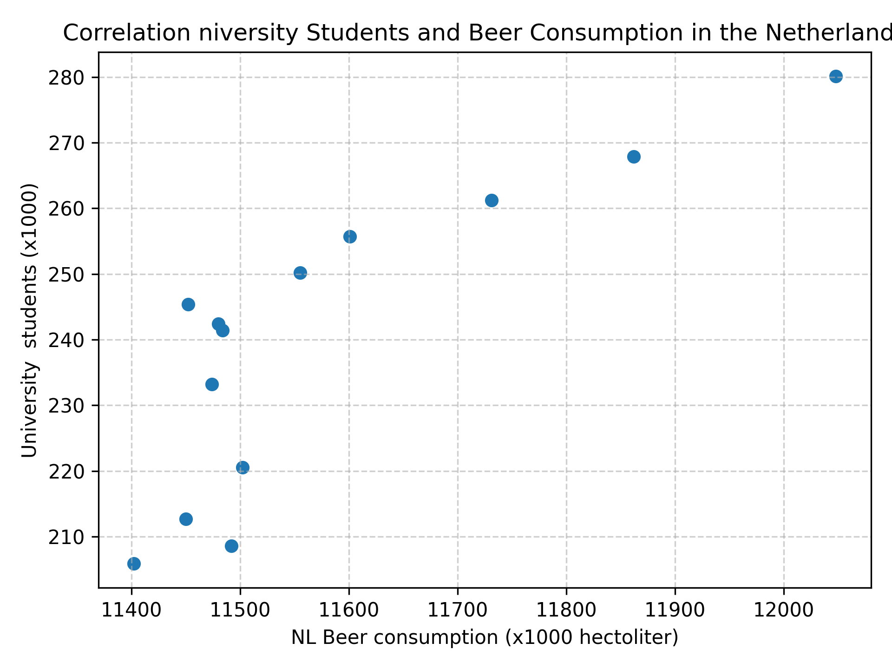

My studentID: 13680706

Some papers:
"Fantastic yeasts and where to find them", MCC Van Dyke et al., 2019,  
"An analysis of the forces required to drag sheep over various surfaces", JT Harvey, Applied Ergonomics, 2002,  
"The neurocognitive effects of alcohol on adolescents and college student", DW Ziegler et al., 2005.  
  
In the image below you will see a scatterplot for the number of university students and the consumption of beer over time. There is a weak positive correlation. When the number of students increase, the consumption of beer tends to increase as well, but not on a clear line.
