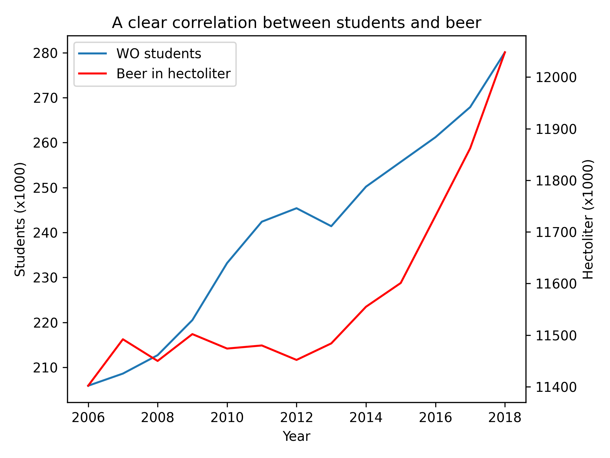

Student number: 1233752

Title of pivotal papers:

  MCC Van Dyke et al., 2019
  JT Harvey, Applied Ergonomics, 2002
  DW Ziegler et al., 2005

Data Plot

### Interpretation:
The plot shows the relationship between `WO [x1000]` and `NL Beer consumption [x1000 hectoliter]` over the years. It shows that while beer consumption remains stable, there seems to be an upward trend in `WO [x1000]`. 

