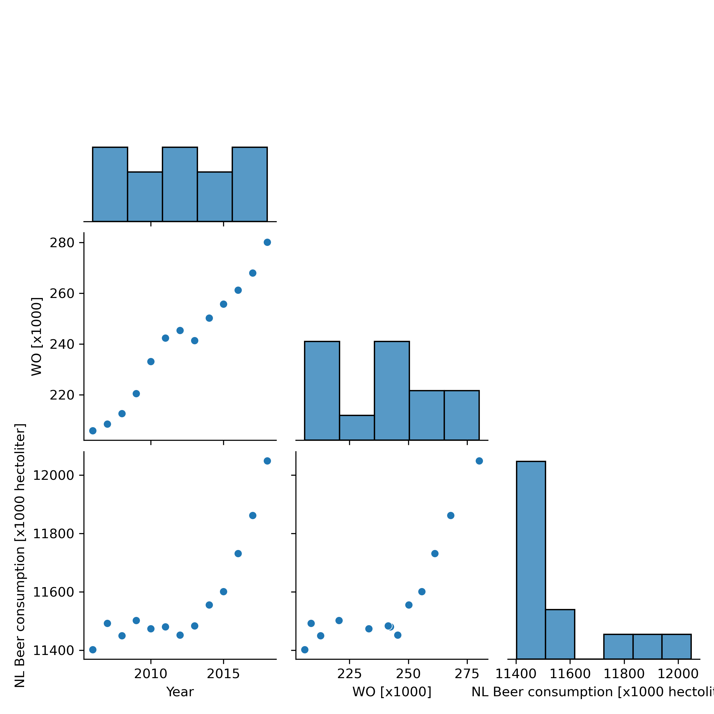

**Titles of our pivotal papers**

MCC Van Dyke et al., 2019: Fantastic yeasts and where to find them

JT Harvey, Applied Ergonomics, 2002: An analysis of the forces required to drag sheep over various surfaces

DW Ziegler et al., 2005: The neurocognitive effects of alcohol on adolescents and college students 

**Our dataset's correlation matrix**
| |Year|WO [x1000]|NL Beer consumption [x1000 hectoliter]|
|-|-|-|-|
|**Year**|1|0.98|0.82|
|**WO [x1000]**|0.98|1|0.81|
|**NL Beer consumption [x1000 hectoliter]**|0.82|0.81|1|

**A pairplot of our dataset**

**Interpretation** 

Assuming that WO refers to the amount of WO students in the netherlands:

There is a strong correlation between the amount of students and the consumption of beer in the Netherlands, suggesting that students are a major consumer, and as their numbers increase, so will beer consumption.
