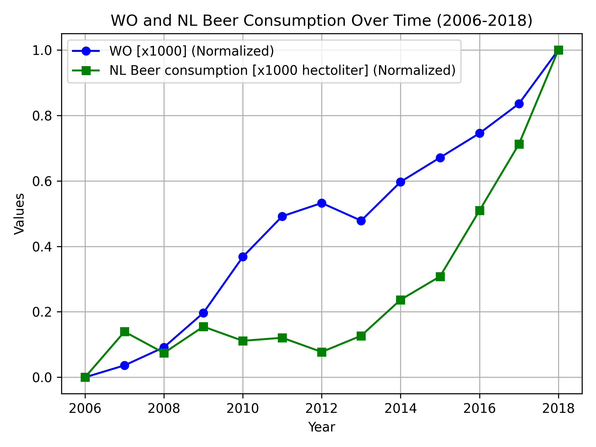

# 15370208
# The Rise of Coccidioides: Forces Against the Dust Devil Unleashed
# An analysis of the forces required to drag sheep over various surfaces
# The neurocognitive effects of alcohol on adolescents and college students

The blue line representing people with higher education has been increasing steadily for the whole time period 2006-2018. In contrast, the green line depicting beer consumption in the Netherlands is more variable. Some fluctuations are evident between 2006 and 2013, but after 2014 it has an upward trend. The two lines suggest that while both metrics rise overall, the beer consumption trend lags slightly behind the WO increase in terms of growth consistency.
