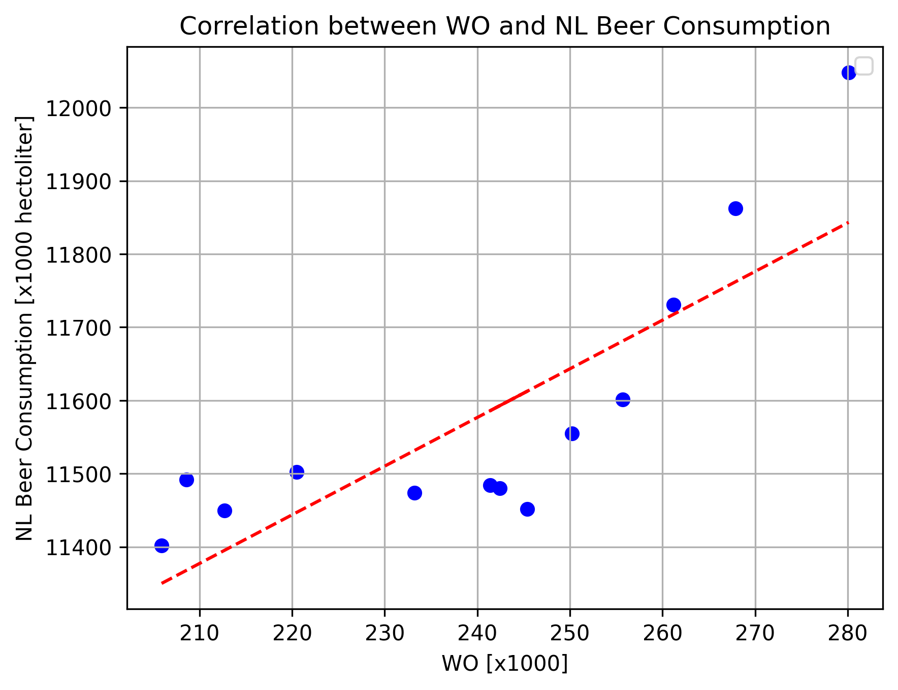

# Assignment L3 Academic Skills

**Student ID:** 15681653

## Key Papers
- MCC Van Dyke et al., 2019
- JT Harvey, Applied Ergonomics, 2002
- DW Ziegler et al., 2005

## Data Plot

### Interpretation Data
The plot with a fitted correlation line shows a positive correlation between WO and NL Beer Consumption. As the WO values increase, beer consumption tends to rise. This suggests a relationship between these two variables. The relationship is not perfectly linear because the data points show some variability around the line. This indicates possible outliers and they may influence the correlation.
