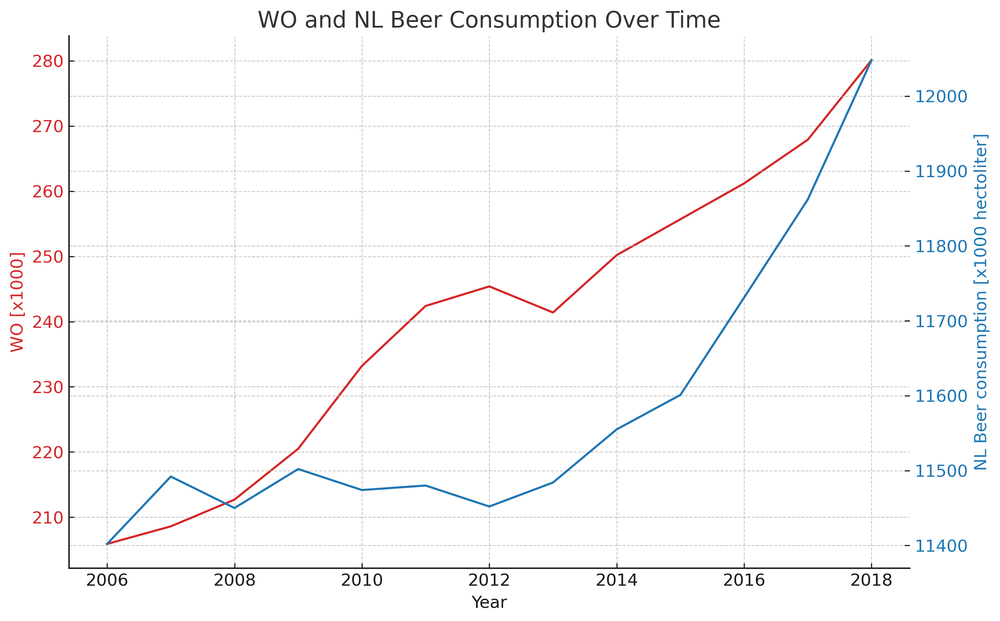

# Assignment L3 Academic Skills

**Student ID:** 15681653

## Key Papers
- MCC Van Dyke et al., 2019
- JT Harvey, Applied Ergonomics, 2002
- DW Ziegler et al., 2005

## Data Plot

### Interpretation
The plot shows a positive correlation between WO and NL Beer Consumption. As the WO values increase, beer consumption tends to rise. This suggests a relationship between these variables.

git add solution_15681653.md correlation_plot.png
git commit -m 
git push origin main
