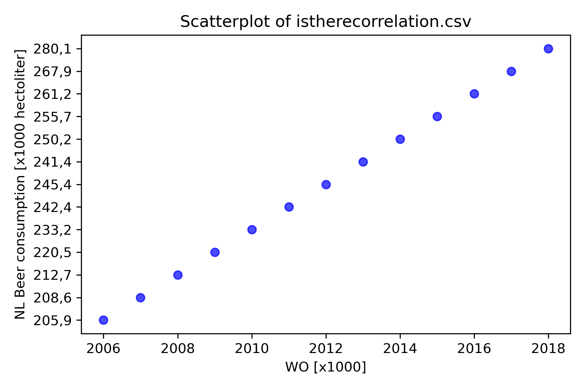

# Solution

**Student ID**: 15984230  

## Paper Titles
- Van Dyke, MCC, et al. (2019). *Fantastic yeasts and where to find them: the hidden diversity of dimorphic fungal pathogens.*  
- Harvey, JT. (2002). *An analysis of the forces required to drag sheep over various surfaces.* *Applied Ergonomics.*  
- Ziegler, DW, et al. (2005). *The neurocognitive effects of alcohol on adolescents and college students.*  

## Plot

The scatter plot shows a strong positive correlation between the number of university graduates (WO [x1000]) and Dutch beer consumption (in thousands of hectoliters). This suggests that as the number of graduates increased, beer consumption also tended to rise, although causation cannot be inferred from this correlation.
