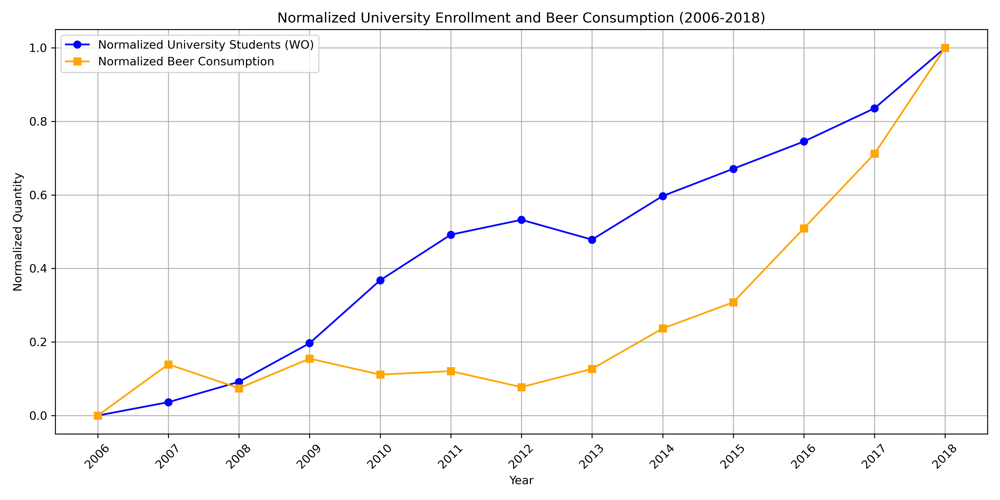

# Student ID
13444514

# Pivotal Papers
1. MCC Van Dyke et al., 2019
2. JT Harvey, Applied Ergonomics, 2002
3. DW Ziegler et al., 2005

# Data Visualization

## Interpretation
The plot illustrates the beerconsumption and the amount of people attending university as a function of the year. The values are normalised to indicate more clearly the correlations. 
As can be seen in the plot that that an increase in people attending university tends to increase the beerconsumption as well indicating a strong correlation. 
