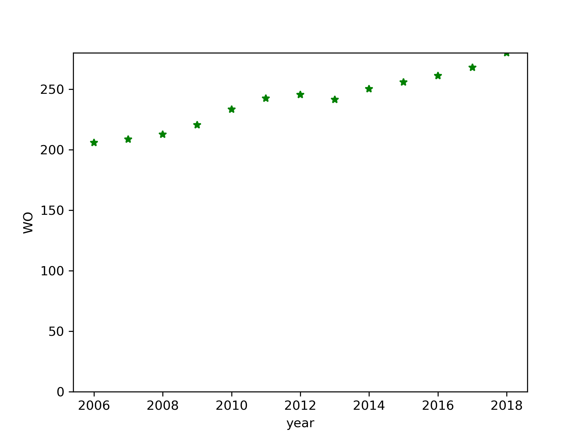
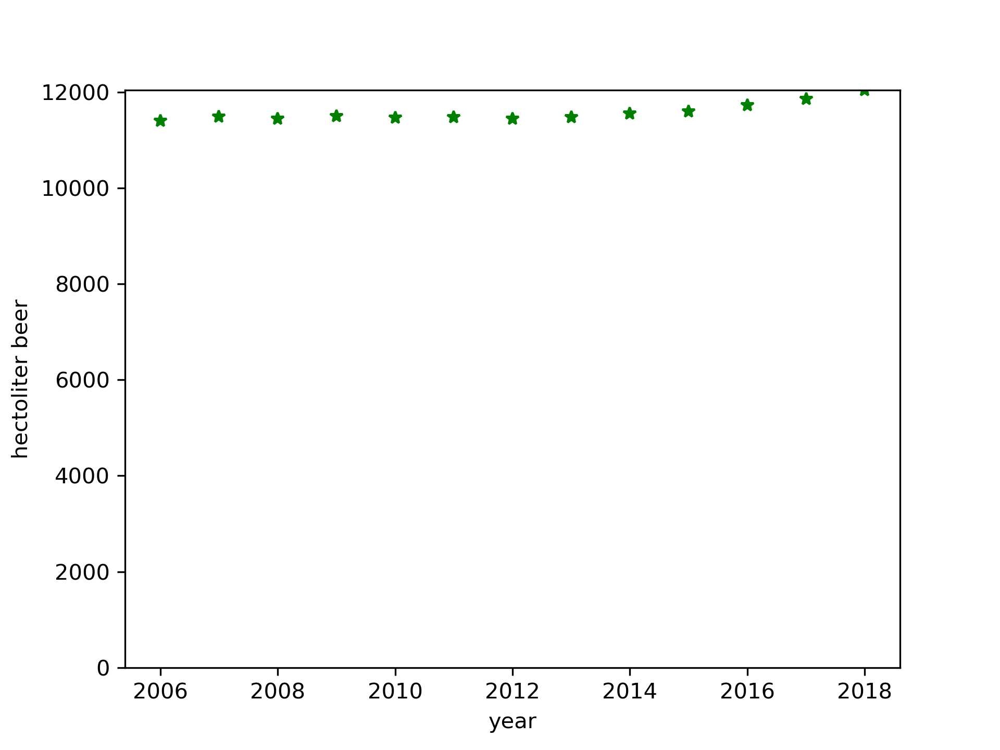

MCC Van Dyke et al., 2019
JT Harvey, Applied Ergonomics, 2002
DW Ziegler et al., 2005

This is the markdown file for the assignment

 
In this plot you can see the developement of the washouts in the years 2006-2018.
A total increase of 74.2 washouts can be seen. 
Average WO: 240.39999999999998 STD WO: 22.432359867628044

 

In this plot you can see the developement of the amount of beer in hectoliter in the years 2006-2018.
A small increase in the amount of beer can be seen. 
Average Hectoliter Beer: 11579.461538461539 STD Hectoliter Beer: 182.2211738877174