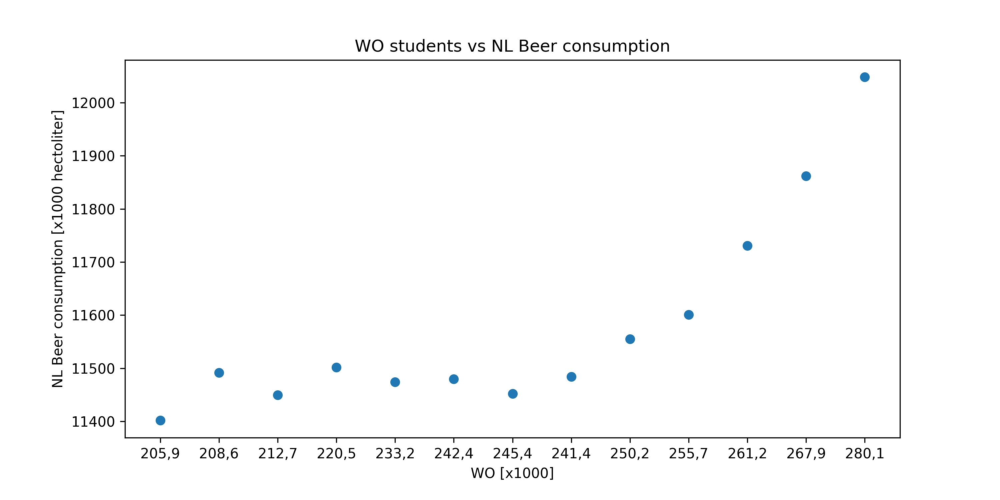

# Is there correlation?

The following pigture with DPI=300 shows the data of beer consumption in Wo and NL from 2006 to 2018.  

Both of beer consumption in Wo and NL show an increasing trend. 

Whilst the increase is relatively stable for Wo, the consumption in NL fluctuated between 2006 and 2012, and shows a progressive increase after 2012.

