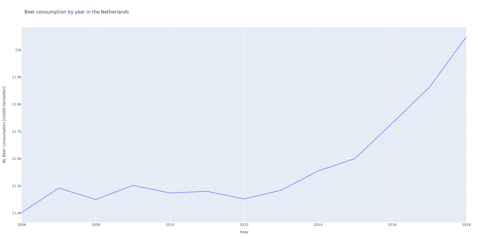

# Mystery Papers:
- CC Van Dyke et al., 2019 [^1]
- JT Harvey, Applied Ergonomics, 2002 [^2]
- DW Ziegler et al., 2005[^3]

[^1]: The Rise of Coccidioides: Forces Against the Dust Devil Unleashed. https://doi.org/10.3389/fimmu.2019.02188

[^2]: An analysis of the forces required to drag sheep over various surfaces. DOI:10.1016/S0003-6870(02)00071-6

[^3] The neurocognitive effects of alcohol on adolescents and college students. DOI: 10.1016/j.ypmed.2004.04.044

# Image part

Only visualized year and beer consumption, as I have no idea what "WO" means.

