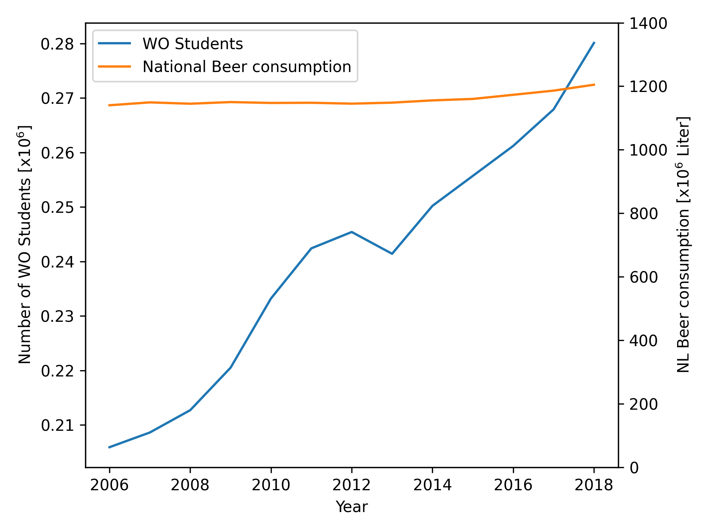

# Computational Scientist's Toolbox Assignment
## Step 4
*give the titles of the given papers*
  - MCC Van Dyke et al., 2019
    - Fantastic yeasts and where to find them: the hidden diversity of dimorphic fungal pathogens
    - The Rise of Coccidioides: Forces Against the Dust Devil Unleashed
  - JT Harvey, Applied Ergonomics, 2002
    - An analysis of the forces required to drag sheep over various surfaces
  - DW Ziegler et al., 2005
    - The neurocognitive effects of alcohol on adolescents and college students

## Step 5
*Create one plot from the dataset "istherecorrelation.csv", with DPI=300. The objective is to visualize 
the data in a way that you consider representative. Include the resulting plot image in the markdown
file and add a few lines of interpretation on the data.*

Using only the data provided in the excercise, this was the least misleading plot I could create. It 
shows a slight increase in student population while the national beer consumption remains relatively 
the same, which should mean that they are not related, however, due to the data presented it is still 
misleading.

A better way to present the data (using population data from the CBS [1]) is by comparing student population 
percentage and beer consumption per capita, as this would also account for population-wide factors.

This clearly shows that student population has no impact on national beer consumption in the netherlands, 
as per capita consumption strongly dips between 2007 and 2013 despite strong growth of student population.

## References
[1] "Population counter" cbs.nl. Accessed: September 27, 2023. [online.] Available: 
https://www.cbs.nl/en-gb/visualisations/dashboard-population/population-counter