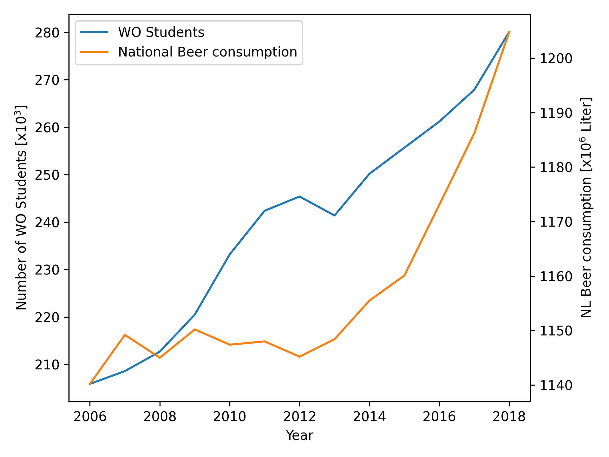

# Computational Scientist's Toolbox Assignment
## 4
*give the titles of the given papers*
  - MCC Van Dyke et al., 2019
    - Fantastic yeasts and where to find them: the hidden diversity of dimorphic fungal pathogens
    - The Rise of Coccidioides: Forces Against the Dust Devil Unleashed
  - JT Harvey, Applied Ergonomics, 2002
    - An analysis of the forces required to drag sheep over various surfaces
  - DW Ziegler et al., 2005
    - The neurocognitive effects of alcohol on adolescents and college students

## 5
*Create one plot from the dataset "istherecorrelation.csv", with DPI=300. The objective is to visualize 
the data in a way that you consider representative. Include the resulting plot image in the markdown
file and add a few lines of interpretation on the data.*

