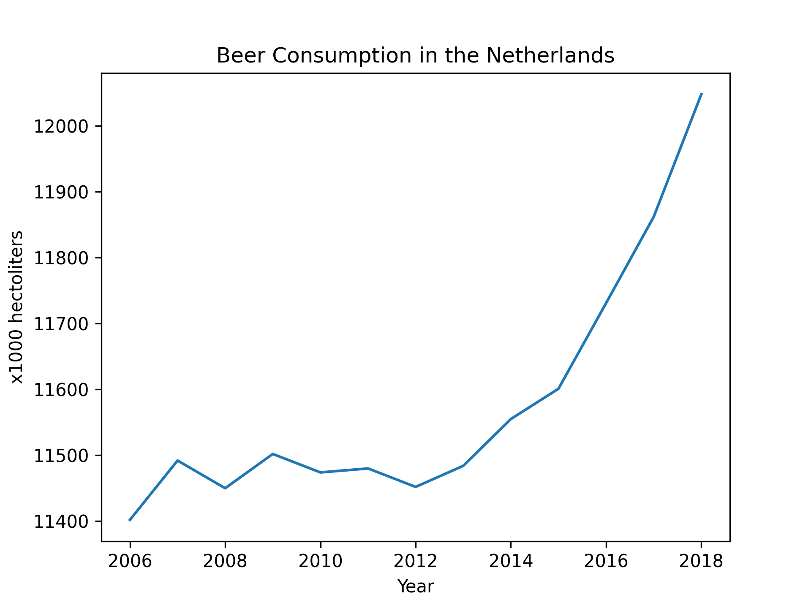

The titles of the papers that are pivotal to our knowledge are:

  -Fantastic yeasts and where to find them: the hidden diversity of dimorphic fungal pathogens  
  -An analysis of the forces required to drag sheep over various surfaces  
  -The neurocognitive effects of alcohol on adolescents and college students

In this figure, both the beer consumption and the amount of university students (WO students) in the Netherlands are plotted against time in years. The correlation between the amount of students and beer consumption is 0.818064. This would suggest that students drink a lot of beer.
