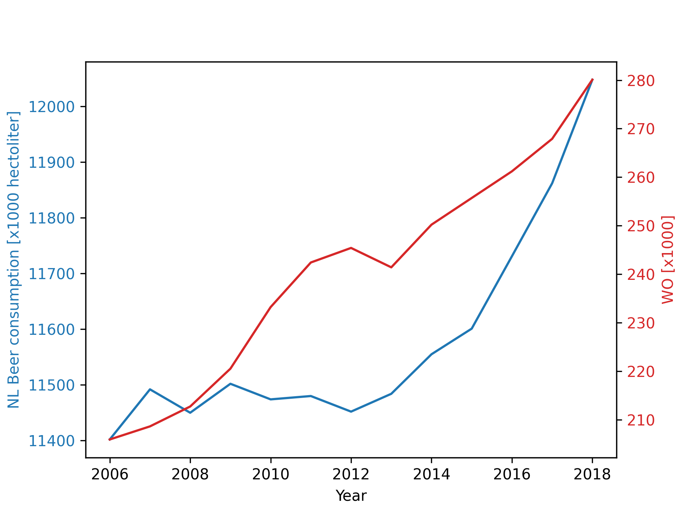

StudentID: 15901475
# Title of Papers
MCC Van Dyke et al., 2019: Fantastic yeasts and where to find them: the hidden diversity of dimorphic fungal pathogens

JT Harvey, Applied Ergonomics, 2002: An analysis of the forces required to drag sheep over various surfaces

DW Ziegler et al., 2005: The neurocognitive effects of alcohol on adolescents and college students

From this plot we can see that there is no correlation between beer consumption in the Netherlands and number of WO students, since the graphs have minimal overlap.
