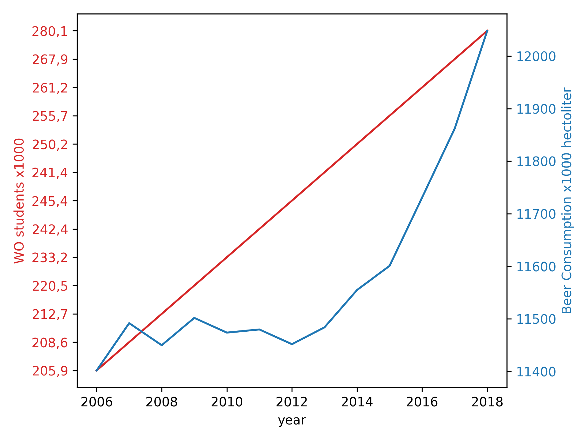

# Solutions Micha den Heijer

## Paper titles
- MCC Van Dyke et al., 2019: "Fantastic yeasts and where to find them: the hidden diversity of dimorphic fungal pathogens"
- JT Harvey, Applied Ergonomics, 2002: "An analysis of the forces required to drag sheep over various surfaces"
- DW Ziegler et al., 2005: "The neurocognitive effects of alcohol on adolescents and college students"

## Plot

We can clearly see that there does not appear to be a relation in the beginning, where the number of students increases, but beer consumption does not. In the later years beer consumption does again increase, however it is with this data set impossible to make final conclusions about the relation.
