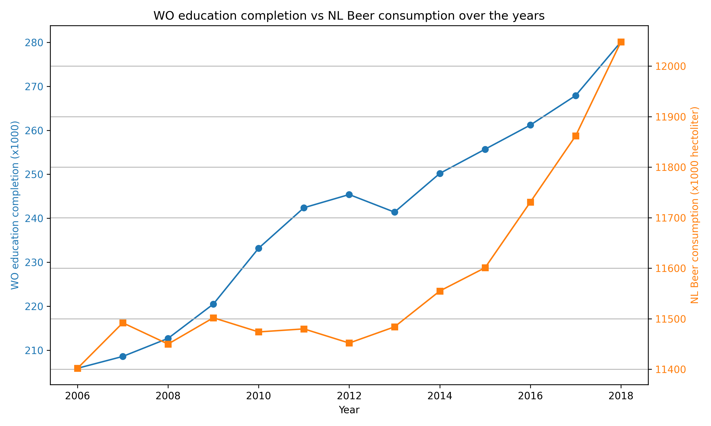

Student Id: 12714933

Titles:

  - MCC Van Dyke et al., 2019:
  - Fantastic yeasts and where to find them: the hidden diversity of dimorphic fungal pathogens

  - JT Harvey, Applied Ergonomics, 2002:
  - An analysis of the forces required to drag sheep over various surfaces

  - DW Ziegler et al., 2005:
  - The neurocognitive effects of alcohol on adolescents and college students

From this image it could be that there is some correlation between the two data
sets provided in the csv file. However, between the years 2010 and 2013, there
seems to be inverted trends between the two datasets which makes it less likely
that there is correlation between the sets. However, it seems a bit weird to
assume correlation between the number of WO students and the amount of beer
consumed by the entire Dutch population. To say more about this actual
correlation, one would have to know the amount of alcohol consumption by WO
students and the amount of alcohol consumption by an average person to state
if the increase in WO students actually increases the nation alcohol
consumption of the Netherlands.
