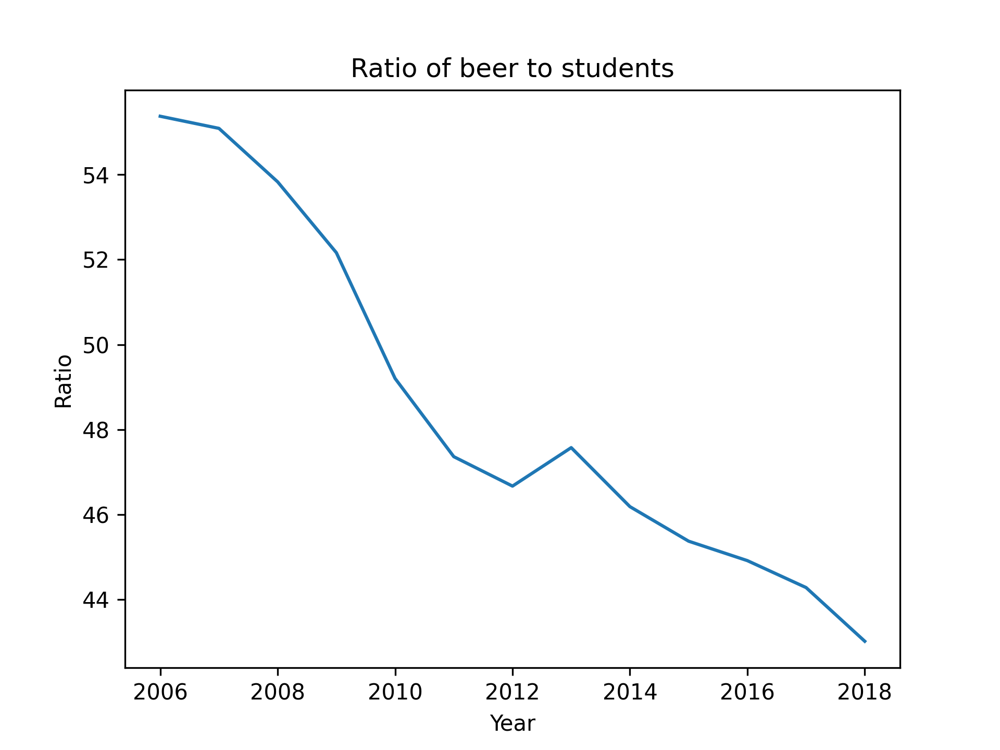

Student ID: 15689980

# Papers

* MCC Van Dyke et al., 2019: "Fantastic yeasts and where to find them: the hidden diversity of dimorphic fungal pathogens"
* JT Harvey, Applied Ergonomics, 2002: "An analysis of the forces required to drag sheep over various surfaces"
* DW Ziegler et al., 2005: "The neurocognitive effects of alcohol on adolescents and college students"

# Plot
In the figure we plot the ratio of the beer being consumed by students to the number of students. This results in showing on average how much beer each student consumes. In the figure we can see that over the years the average student drinks less then the previous year with the expection being 2013.
