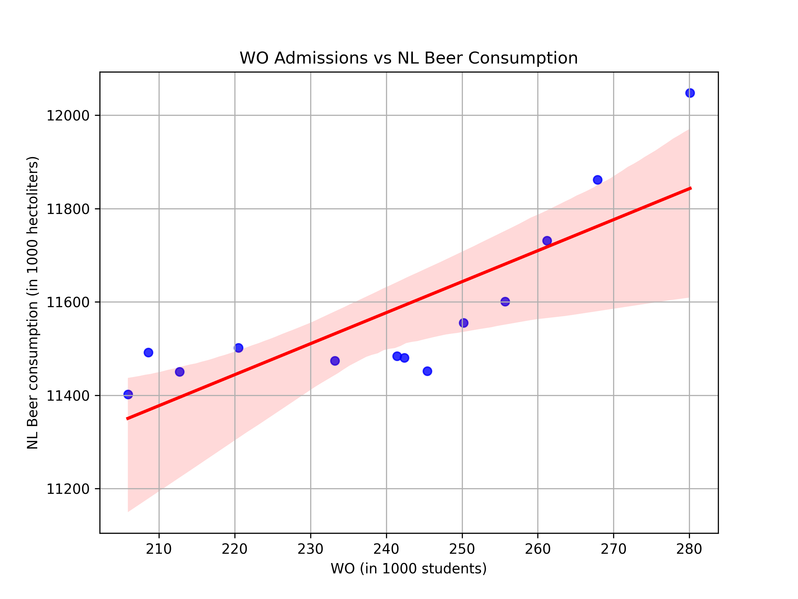

# Solution File

### Student ID: 
14379031

### Titles of papers pivotal to our knowledge:
1. _MCC Van Dyke et al., 2019_: "Fantastic yeasts and where to find them" **OR** "The Rise of Coccidioides: Forces Against the Dust Devil Unleashed"
2. _JT Harvey et al., Applied Ergonomics, 2002_: "An analysis of the forces required to drag sheep over various surfaces"
3. _DW Ziegler et al., 2005_: "The neurocognitive effects of alcohol on adolescents and college students"

### Plotting task:

The above plot shows that there is a positive correlation between the number of students following WO courses in the Netherlands and the total beer consumption (hectoliter = 100 liters). This means, as the number of students in WO increases, the total beer consumption of the country increases!

