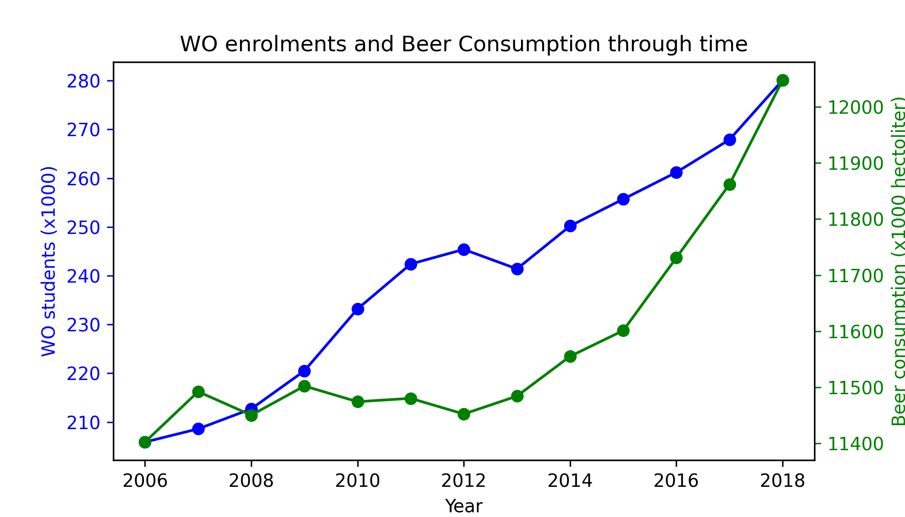

Apologies for handing in this exercise a little after the deadline. 

#### Student ID
11320788

#### Papers
Fantastic yeasts and where to find them: the hidden diversity of dimorphic fungal pathogens

An analysis of the forces required to drag sheep over various surfaces

The neurocognitive effects of alcohol on adolescents and college students

#### Data analysis

The relative increase in WO students is much larger than the relative increase in beer consumption. Despite this observation, there seems to be a slight correlation between WO enrolments and beer consumption, although the years 2010-2013 seem to contradict this trend.