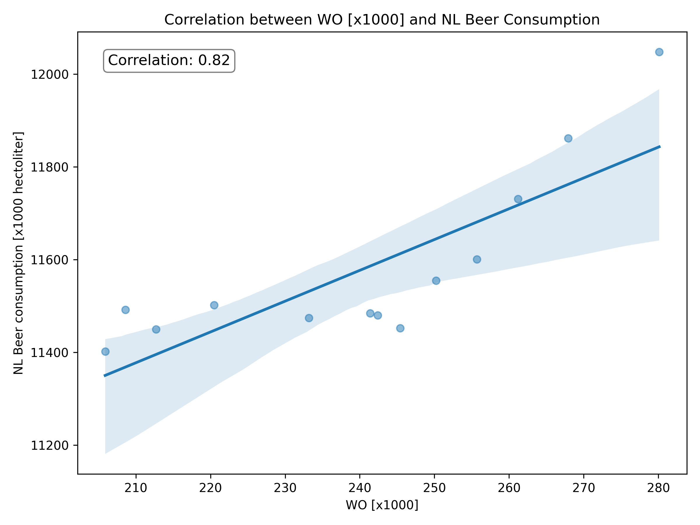

Student Number: **15631265**

Relevant Papers:
*Fantastic yeasts and where to find them: the hidden diversity of dimorphic fungal pathogens* - MCC Van Dyke et al., 2019

*An analysis of the forces required to drag sheep over various surfaces* - JT Harvey, Applied Ergonomics, 2002

*The neurocognitive effects of alcohol on adolescents and college students* - DW Ziegler et al., 2005 

Results & Interpretation

The chart presents a relatively strong correlation (0.82) between the two variables, indicating that the number of students is highly associated with alcohol consumption. However, it is important to note that correlation does not imply causation, meaning we cannot conclude that changes in student numbers directly cause changes in alcohol consumption (or vice versa). The graph illustrates the original dataset, along with a linear trend line representing their relationship. The error bars in the graph reflect the uncertainty or variability in the data, but they are not directly related to the calculation of the correlation coefficient.