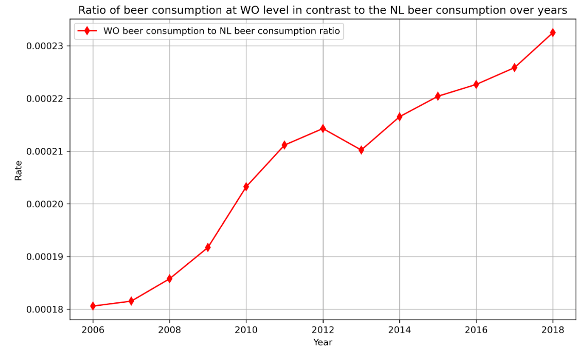

Student ID: 15888592

Fantastic yeasts and where to find them: the hidden diversity of dimorphic fungal pathogens

The Rise of Coccidioides: Forces Against the Dust Devil Unleashed

An analysis of the forces required to drag sheep over various surfaces

Correlation of continuous cardiac output measured by a pulmonary artery catheter versus impedance cardiography in ventilated patients

This plot shows the proportion of annual beer consumption by individuals at the university level (WO) relative to the total beer consumption per year. As can be seen, the proportion of WO beer consumption lies between approximately 0.0018 and 0.0024 according to the plot.