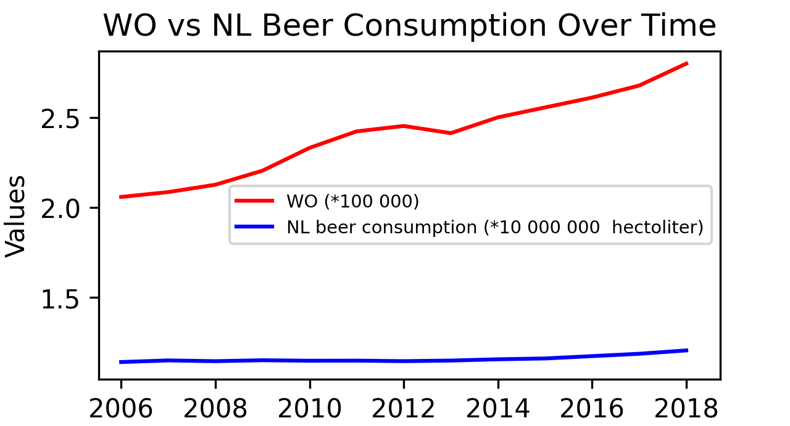

# student ID
15340791

# Titles

MCC Van Dyke et al., 2019: 
- Fantastic yeasts and where to find them: the hidden diversity of dimorphic fungal pathogens
- The Rise of Coccidioides: Forces Against the Dust Devil Unleashed

JT Harvey, Applied Ergonomics, 2002:
- An analysis of the forces required to drag sheep over various surfaces

DW Ziegler et al., 2005:
- The neurocognitive effects of alcohol on adolescents and college students

# Figure

In this figure the beer concumption and number of WO students is visualized over a time period of 12 years

