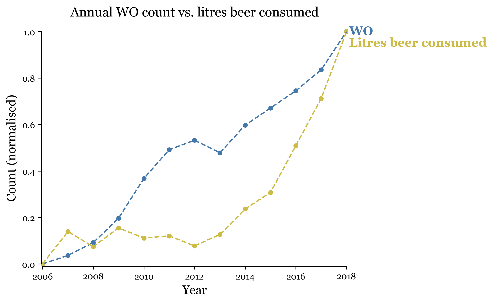

# **Student ID:** 15393879

Pivotal papers:
- _Fantastic yeasts and where to find them: the hidden diversity of dimorphic fungal pathogens_ [MCC Van Dyke et al., 2019]
- _An analysis of the forces required to drag sheep over various surfaces_ [JT Harvey, Applied Ergonomics, 2002]
- _The neurocognitive effects of alcohol on adolescents and college students_ [DW Ziegler et al., 2005]

## Correlation between WO count and beer consumption

The following plot shows the normalised annual WO count and beer consumption in the Netherlands.

While the two data sources appear particularly correlated in this plot, it is important to note that there are likely to be confounding factors at play. In particular, both variables are likely to increase with population growth. 

The fact that the values are normalised independently can also lead to misguided interpretations, since normalisation removes any information about the variables' gradient.

Choice of time window can also contribute to confusion. For instance, if we were to instead remove any data below 2013, the plot would look significantly more correlated. This is due to changes in the normalisation scales for the two variables.