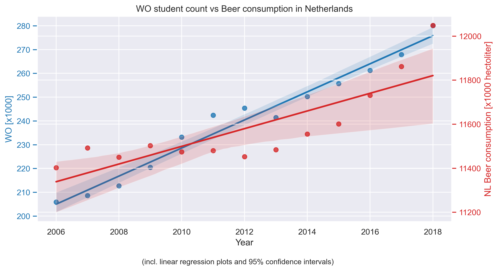

# Solution

## Correlation Analysis

We have analysed the following [data set](istherecorrelation.csv) using typical numerical methodologies, searching for and quantifiying correlation.

By pure visual analysis, we can already see that the trend lines between WO student count and beer consumption in the Netherlands appear to correlate significantly. This can be further quanitifed by determining the Pearson correlation coefficients (PCC). After computing the correlation matrix, we find a PCC of 0.82 between the WO student count and beer consumption in the Netherlands within the time frame observed. However, it is to note that there also are very significant 0.98 and 0.83 PCC between time and student count as well as time and beer consumption, respectively.

## Sources

Instrumental papers for this submission:

- [_Fantastic yeasts and where to find them: the hidden diversity of dimorphic fungal pathogens_](https://doi.org/10.1016/j.mib.2019.05.002) or [_The Rise of Coccidioides: Forces Against the Dust Devil Unleashed_](https://doi.org/10.3389/fimmu.2019.02188) (MCC Van Dyke et al., 2019)
- [_An analysis of the forces required to drag sheep over various surfaces_](https://doi.org/10.1016/S0003-6870(02)00071-6) (JT Harvey, Applied Ergonomics, 2002)
- [_CORRELATION OF CONTINUOUS CARDIAC OUTPUT MEASURED BY A PULMONARY ARTERY CATHETER VERSUS IMPEDANCE CARDIOGRAPHY IN VENTILATED PATIENTS_](https://doi.org/10.1378/chest.128.4_MeetingAbstracts.194S-a) (DW Ziegler et al., 2005)
