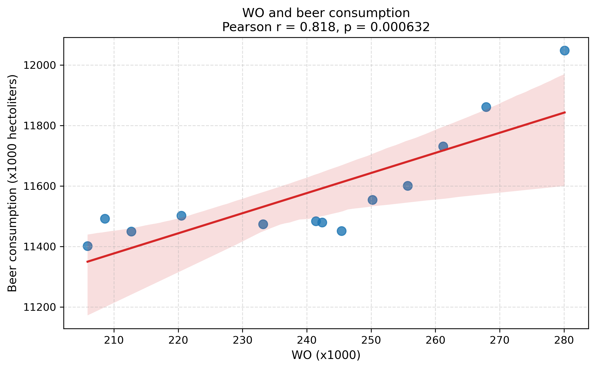

studentID = '13231952'

Paper references: (not sure if this is right)

MCC Van Dyke et al., 2019: "Fantastic yeasts and where to find them: the hidden diversity of dimorphic fungal pathogens" 

JT Harvey, Applied Ergonomics, 2002: "An analysis of the forces required to drag sheep over various surfaces"

DW Ziegler et al., 2005: "Kinematic and chemical evolution of early-type galaxies"

The plot I made is a scatter plot with an linear fit line (OLS regression) incl the shaded 95 % confidence interval (denoting the uncertainty in our estimated mean trend).
It shows a clear positive relationship between the number of university graduates (WO, in thousands) and Dutch beer consumption (in thousands of hectoliters) from 2006 to 2018. We see that as the numbers of graduates rise, beer consumption also tends to increase in volume. The very low p-value also indicates we did not obtain this correlation result by chance, and that there certainly is a strong relationship. Regarding the nature of this relationship - it's not exactly linear. We see this in the way the OLS line of fit does not actually correspond to the underlying data scatter, i.e. was a model too simple to capture all the complexity that exists around these variables.
