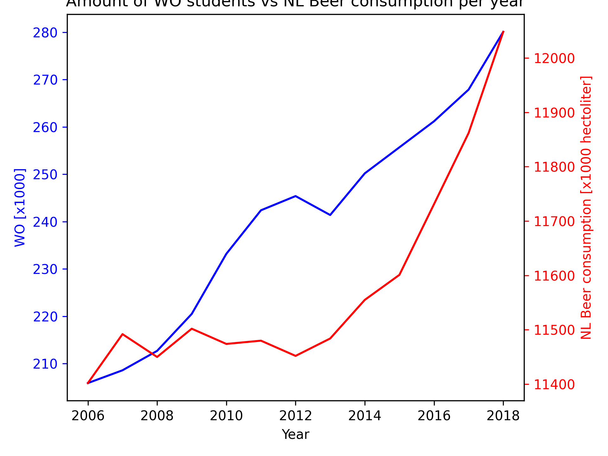

MCC Van Dyke et al., 2019
Fantastic yeasts and where to find them: the hidden diversity of dimorphic fungal pathogens

JT Harvey, Applied Ergonomics, 2002
An analysis of the forces required to drag sheep over various surfaces

DW Ziegler et al., 2005
The neurocognitive effects of alcohol on adolescents and college students

In this plot is visible the amount of dutch university students and the beer consumption in the 
Netherlands. Both trends are positive, but there does not seem to be a very direct correlation 
between the two, because when the amount of students went down in 2013, the beer consumption 
still went up. Both trends are likely to be tied with population growth, so there is no proof
that the two factors are actually correlated. 
