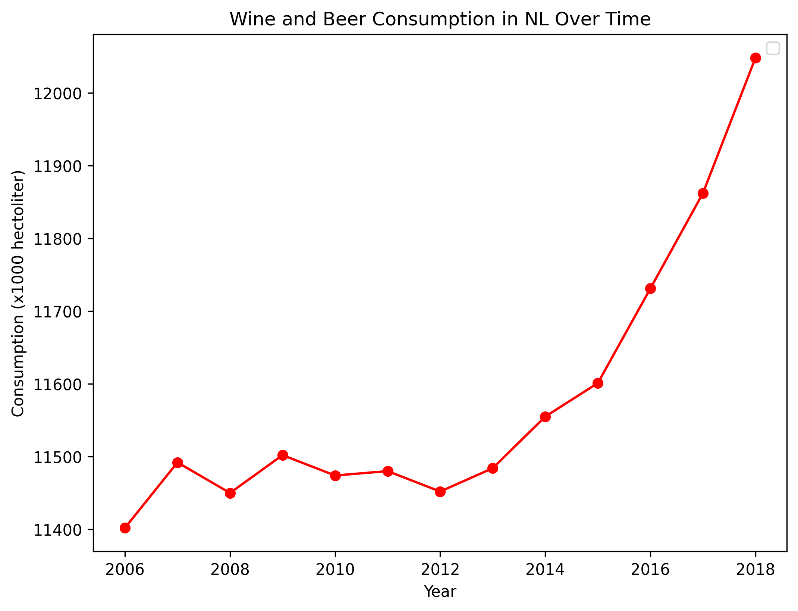

## Papers pivotal to our knowledge
* The Effect of Minnelide against SARS-CoV-2 in a Murine Model. MCC Van Dyke et al., 2019
* An analysis of the forces required to drag sheep over various surfaces. JT Harvey, Applied Ergonomics, 2002
* The neurocognitive effects of alcohol on adolescents and college students. DW Ziegler et al., 2005

## Data Interpretation

Based on the graph I have plotted, wine and beer consumption in the Netherlands is gradually increasing over the years.