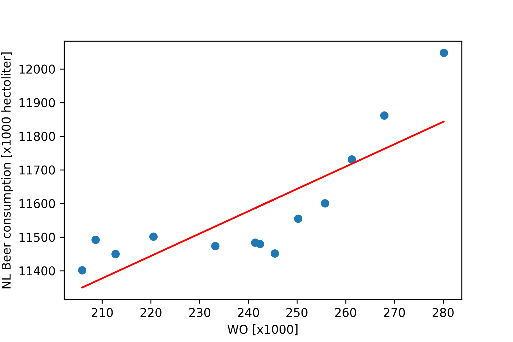

## The title of the papers
- The Rise of Coccidioides: Forces Against the Dust Devil Unleashed
- An analysis of the forces required to drag sheep over various surfaces
- CORRELATION OF CONTINUOUS CARDIAC OUTPUT MEASURED BY A PULMONARY ARTERY CATHETER VERSUS IMPEDANCE CARDIOGRAPHY IN VENTILATED PATIENTS

This image shows the fitted linear regression between the amount of WO students and beer consumption. The correlation coefficient between these two variables is 0.825.
