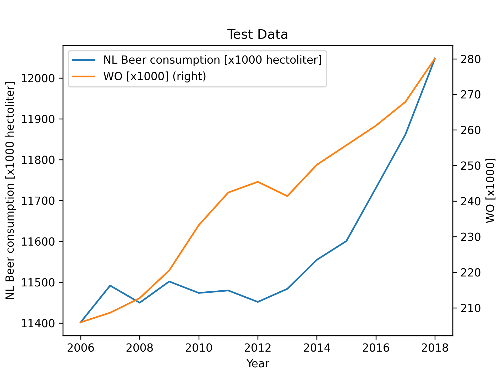

# MCC Van Dyke et al., 2019
# JT Harvey, Applied Ergonomics, 2002
# DW Ziegler et al., 2005

Not sure what the WO variable means, so that's why I decided to plot both variables against year as a lineplot. I also calculated the correlation between both variables (beer consumption and wo), which is 0.8180643555130896.