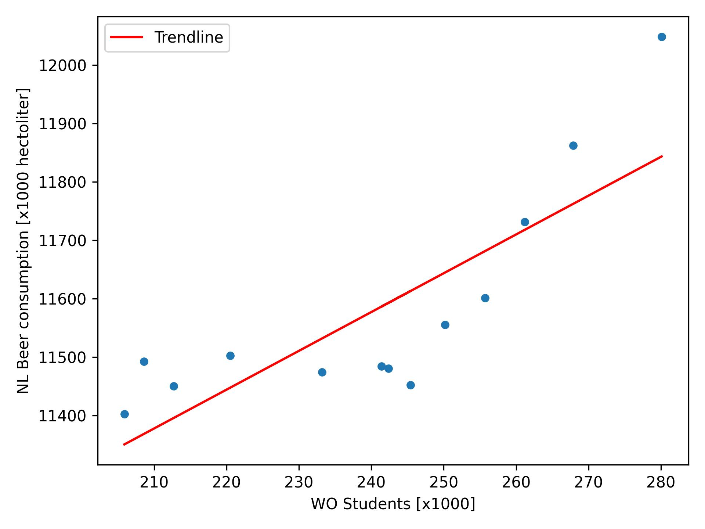

# Computational Scientist's Toolbox

Author: Tim de Groot,
Student ID: 12986887

## Results & Discussion

The figure above shows the correlation between the number of WO Students and Beer Consumption in the Netherlands. A trendline was determined using a polynomial fit from numpy which is also plotted in the same figure. The polynomial fit gave $B(S) = 6.645\times S+9981.9$ with $B$ being the NL Beer consumption (in 1000 hectoliter) and $S$ the number of WO Students (x 1000). Both the figure and polynomial fit show a clear correlation between the two metrics.

Closer inspection of the data shows that both metrics show an increase over time. It is therefore plausible that the correlation we see is merely caused by the fact that both metrics increase every year.

## Bibliography

1. Van Dyke, M. C. C., Teixeira, M. M. & Barker, B. M. Fantastic yeasts and where to find them: the hidden diversity of dimorphic fungal pathogens. *Current Opinion in Microbiology* **52**, 55–63 (2019).
2. Harvey, J. T. et al. An analysis of the forces required to drag sheep over various surfaces. *Applied Ergonomics* **33**, 523–531 (2002).
3. Zeigler, D. W. et al. The neurocognitive effects of alcohol on adolescents and college students. *Preventive Medicine* **40**, 23–32 (2005).
